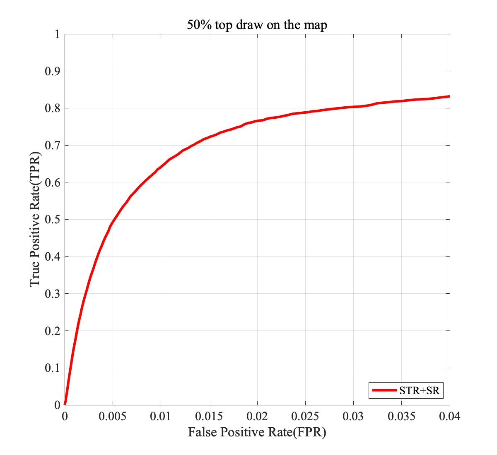

<p align="center">
  <h1 align="center"> Indoor Obstacle Discovery on Reflective Ground via Monocular Camera </h1>
  <p align="center">
    <a href="https://xuefeng-cvr.github.io"><strong>Feng Xue</strong></a>
    ·
    <a href=""><strong>Yicong Chang</strong></a>
    ·
    <a href=""><strong>Tianxi Wang</strong></a>
    ·
    <a href="https://yuzhou.vlrlab.net"><strong>Yu Zhou</strong></a>
    ·
    <a href="https://teacher.bupt.edu.cn/mal"><strong>Anlong Ming</strong></a>
  </p>
  <h2 align="center">IJCV 2023</h2>
  <h3 align="center"><a href="https://link.springer.com/article/10.1007/s11263-023-01925-4">Paper</a> | <a href="https://xuefeng-cvr.github.io/IODRG">Project Page</a></h3>
  <div align="center"></div>
</p>
<p align="center">
  <a href="">
    
  </a>
  <!-- <video controls loop>
    <source src="img/ijcv_intro.mp4" type="video/mp4">
    Your browser does not support the video tag.
  </video>
  <script>
  var video = document.getElementById("myVideo");
  video.addEventListener("ended", function() {
    video.currentTime = 0;
    video.play();
  });
  </script> -->
</p>
<p align="center">
<strong>IndoorObstacleDiscovery-RG</strong> is an approach to discover obstacles on the reflective ground using spatial-temporal features.
</p>
<br>


## News
 - 2023.11.29 The code has been released !!!
 - 2023.10.3 This paper has been accepted by International Journal of Computer Vision (IJCV)!!!
 - 2023.4.10 The project page is about to go live.
 - 2023.4.10 Once the manuscript is accepted, the code and dataset will be fully released.


## Introduction

Visual obstacle discovery is a key step towards autonomous navigation of indoor mobile robots. Successful solutions have many applications in multiple scenes. One of the exceptions is the reflective ground. In this case, the reflections on the floor resemble the true world, which confuses the obstacle discovery and leaves navigation unsuccessful. We argue that the key to this problem lies in obtaining discriminative features for reflections and obstacles. Note that obstacle and reflection can be separated by the ground plane in 3D space. With this observation, we firstly introduce a pre-calibration based ground detection scheme that uses robot motion to predict the ground plane. Due to the immunity of robot motion to reflection, this scheme avoids failed ground detection caused by reflection. Given the detected ground, we design a ground-pixel parallax to describe the location of a pixel relative to the ground. Based on this, a unified appearance-geometry feature representation is proposed to describe objects inside rectangular boxes. Eventually, based on segmenting by detection framework, an appearance-geometry fusion regressor is designed to utilize the proposed feature to discover the obstacles. It also prevents our model from concentrating too much on parts of obstacles instead of whole obstacles. For evaluation, we introduce a new dataset for **Obstacle on Reflective Ground (ORG)**, which comprises 15 scenes with various ground reflections, a total of more than 200 image sequences and 3400 RGB images. The pixel-wise annotations of ground and obstacle provide a comparison to our method and other methods. By reducing the misdetection of the reflection, the proposed approach outperforms others.


## Dataset Preparation

The dataset can be downloaded from this [link](https://drive.google.com/file/d/1SUjY7eHW4iPjTslXKGH523DRCe7oChHa/view?usp=sharing).
More details about the dataset can be found in [the project page](https://xuefeng-cvr.github.io/IODRG).

**Obstacle on Reflective Ground (ORG)**

The ORG dataset folder should have the following structure:
<br>

```
     └── ORG_DATASET_ROOT
         |
         ├── image
              ├── test
                   ├── 19_TeachingBuilding3_F1Hall
                        ├── 001
                            | 19_TeachingBuilding3_F1Hall_001_0000001_image.png
                            | 19_TeachingBuilding3_F1Hall_001_0000002_image.png
                            | ...
                        ├── 002
                        ├── 003
                        ├── ...
                   ├── 20_TeachingBuilding3_F6Corridor
                   ├── 22_ParkBuilding_F1Hall
                   ├── ...
              ├── train
                   ├── 16_ResearchBuilding_F8
                   ├── 17_ResearchBuilding_F6Corridor
                   ├── ...
         ├── gtCoarse_Segmentation
              ├── test
                   ├── 19_TeachingBuilding3_F1Hall
                        | 19_TeachingBuilding3_F1Hall_001_0000001_gtCoarse_labelIds.png
                        | 19_TeachingBuilding3_F1Hall_001_0000002_gtCoarse_labelIds.png
                        | ...
                   ├── 20_TeachingBuilding3_F6Corridor
                   ├── ...
              ├── train
         ├── odometry
         └── timestamp
```

## Preparation

Start by cloning the repo:
```bash
git clone https://github.com/xuefeng-cvr/IndoorObstacleDiscovery-RG.git
```

**Step 1**: You need to make sure the following software and libraries have been installed:

```
Matlab (2023a recommended)
OpenCV (4.8.1 recommended)
Boost  (1.83  recommended)
```
Other libraries have been included in this repository. 

**Step 2**: Since part of our code is implemented in C++, we provide the compiled code for these cpp files:

```bash
mex -I<OpenCV_include_folder> -L<OpenCV_lib_folder> -lopencv_core -lopencv_highgui -lopencv_imgproc -lopencv_tracking -lopencv_video LKopticalflow.cpp
mex -I<OpenCV_include_folder> -L<OpenCV_lib_folder> -lopencv_core -lopencv_highgui -lopencv_imgproc -lopencv_tracking -lopencv_video LKopticalflow_fb.cpp
mex -I<OpenCV_include_folder> -L<OpenCV_lib_folder> -lopencv_core -lopencv_highgui -lopencv_imgproc -lopencv_tracking -lopencv_video -lopencv_calib3d -lopencv_features2d pose_estimation_2d.cpp
mex -I<OpenCV_include_folder> -I<BOOST_include_folder> -L<OpenCV_lib_folder> -lopencv_core -lopencv_imgproc mex_compute_feathsv_integral.cpp
mex -I<OpenCV_include_folder> -I<BOOST_include_folder> -L<OpenCV_lib_folder> -lopencv_core -lopencv_imgproc mex_GeoFeat.cpp
mex -I<OpenCV_include_folder> -I<BOOST_include_folder> -L<OpenCV_lib_folder> -lopencv_core -lopencv_imgproc mex_hsi_std.cpp
mex -I<OpenCV_include_folder> -I<BOOST_include_folder> -L<OpenCV_lib_folder> -lopencv_core -lopencv_imgproc mex_HSVdist.cpp
mex -I<OpenCV_include_folder> -I<BOOST_include_folder> -L<OpenCV_lib_folder> -lopencv_core -lopencv_imgproc mex_MaxPb.cpp
mex -I<OpenCV_include_folder> -I<BOOST_include_folder> -L<OpenCV_lib_folder> -lopencv_core -lopencv_imgproc mex_probmap.cpp
mex scoreboxesMex_refine.cpp
```

`<OpenCV_include_folder>`:    The OpenCV header file folder on your PC or Mac.

`<BOOST_include_folder>`:     The Boost header file folder on your PC or Mac.

`<OpenCV_lib_folder>`:        The OpenCV library folder on your PC or Mac.


## Run
First of all,
please enter the path to the ORG dataset into `vars.abspath_ORG` and the path to the test folder into  `vars.abspath_test`:

```
vars.abspath_ORG    = '<Please enter the path to the ORG dataset>';
vars.abspath_test   = '<Please enter the path to the test folder (used to save results)>';
```

Then, for running the algorithm on the ORG dataset,
you can run the script in Matlab:
```bash
test.m
```
Then, when the code is finished running, the program automatically performs an evaluation.

## Training
First of all,
please enter the path to the ORG dataset into `vars.abspath_ORG` and the path to the training folder into  `vars.abspath_test`:

```
vars.abspath_ORG    = '<Please enter the path to the ORG dataset>';
vars.abspath_train  = '<Please enter the path to the training folder (used to save by-products file)>';
```

Then,
for training the algorithm on the ORG dataset,
you can run the script in Matlab:
```bash
train.m
```
The pretrained models can be found in `./model/OD_rfmodel_AGFM.mat`.

## Visualization
```bash
./result/figuredraw.m
```
Then, you will get the following figure and output, which exceeds the performance of our IJCV paper.
<p align="center">
  <a href="">
    
  </a>
</p>

```
TPR:0.76615  FPR:0.02015  ITPR:0.79683  IFPR:1.9485
```

## Citation
```
@Article{ijcv_org,
     title={Indoor Obstacle Discovery on Reflective Ground via Monocular Camera},
     author={Xue, Feng and Chang, Yicong and Wang, Tianxi and Zhou, Yu and Ming, Anlong},
     journal={International Journal of Computer Vision (IJCV)},
     year={2023}
}

```


## License

This repository is released under the Apache 2.0 license as found in the [LICENSE](LICENSE) file.