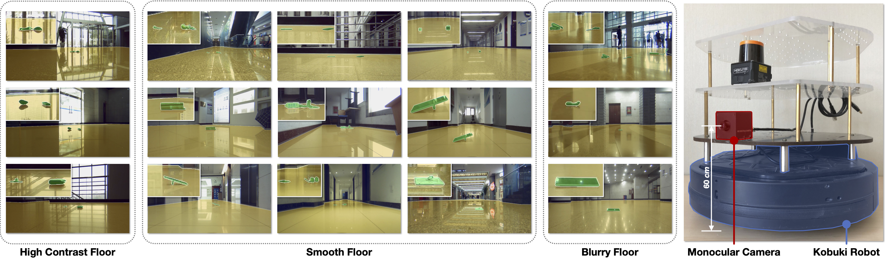

# Indoor Obstacle Discovery on Reflective Ground via Monocular Camera

#### [Feng Xue](https://xuefengbupt.github.io/), [Yicong Chang](), [Tianxi Wang](), [Yu Zhou](https://yuzhou.vlrlab.net/), [Anlong Ming](https://teacher.bupt.edu.cn/mal) ####

### [`Paper`]() [`Project`]() [`Dataset`]() 

# News
 - 2023.4.10 The project page is about to go live.
 - 2023.4.10 Once the manuscript is accepted, the code and dataset will be fully released.

# Introduction

Visual obstacle discovery is a key step towards autonomous navigation of indoor mobile robots. Successful solutions have many applications in multiple scenes. One of the exceptions is the reflective ground. In this case, the reflections on the floor resemble the true world, which confuses the obstacle discovery and leaves navigation unsuccessful. We argue that the key to this problem lies in obtaining discriminative features for reflections and obstacles. Note that obstacle and reflection can be separated by the ground plane in 3D space. With this observation, we firstly introduce a pre-calibration based ground detection scheme that uses robot motion to predict the ground plane. Due to the immunity of robot motion to reflection, this scheme avoids failed ground detection caused by reflection. Given the detected ground, we design a ground-pixel parallax to describe the location of a pixel relative to the ground. Based on this, a unified appearance-geometry feature representation is proposed to describe objects inside rectangular boxes. Eventually, based on segmenting by detection framework, an appearance-geometry fusion regressor is designed to utilize the proposed feature to discover the obstacles. It also prevents our model from concentrating too much on parts of obstacles instead of whole obstacles. For evaluation, we introduce a new dataset for Obstacle on Reflective Ground (ORG), which comprises 15 scenes with various ground reflections, a total of more than 200 image sequences and 3400 RGB images. The pixel-wise annotations of ground and obstacle provide a comparison to our method and other methods. By reducing the misdetection of the reflection, the proposed approach outperforms others.




# Dataset Preparation

The dataset can be downloaded from this [link]().
More details about the dataset can be found in [the project page]().

**Obstacle on Reflective Ground (ORG)**

Please put the corresponding json files in Google Cloud Disk into ./anntoations

The ORG dataset folder should have the following structure:
<br>

     └── ORG_DATASET_ROOT
         |
         ├── image
              ├── test
                   ├── 19_TeachingBuilding3_F1Hall
                        ├── 001
                            | 19_TeachingBuilding3_F1Hall_001_0000001_image.png
                            | 19_TeachingBuilding3_F1Hall_001_0000002_image.png
                            | ...
                        ├── 002
                        ├── 003
                        ├── ...
                   ├── 20_TeachingBuilding3_F6Corridor
                   ├── 22_ParkBuilding_F1Hall
                   ├── 23_ParkBuilding_B1Corridor
                   ├── 24_ParkBuilding_B1Hall
                   ├── 26_ResearchBuilding_F1Hall
                   ├── 28_TeachingBuilding_F1Backdoor
              ├── train
                   ├── 16_ResearchBuilding_F8
                   ├── 17_ResearchBuilding_F6Corridor
                   ├── 18_TeachingBuilding3_F1Door
                   ├── 21_ResearchBuilding_F6Hall
                   ├── 25_ResearchBuilding_F6Hall
                   ├── 27_ResearchBuilding_F1Corridor
                   ├── 29_TeachingBuilding_F6Hall
                   ├── 30_TeachingBuilding_F5Window
         ├── gtCoarse
              ├── test
                   ├── 19_TeachingBuilding3_F1Hall
                        | 19_TeachingBuilding3_F1Hall_001_0000001_gtCoarse_labelIds.png
                        | 19_TeachingBuilding3_F1Hall_001_0000002_gtCoarse_labelIds.png
                        | ...
                   ├── 20_TeachingBuilding3_F6Corridor
                   ├── ...
              ├── train
         ├── odometry
         └── timestamp

# Training
```bash

```
The pretrained models can be downloaded from [link]().

# Test
```bash

```

# Evaluation
```bash

```

# Visualization
```bash

```


# License

This repository is released under the Apache 2.0 license as found in the [LICENSE](LICENSE) file.
